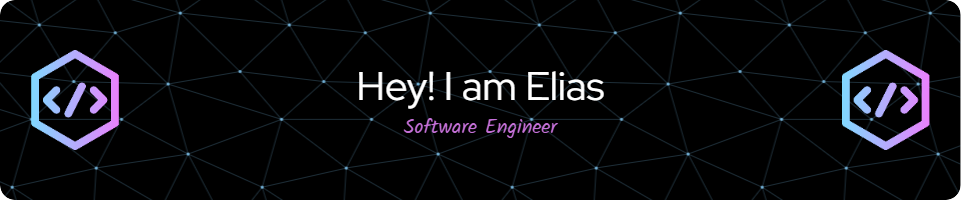

# 👋 Elias (Software Engineer) 

Hello World! Welcome to my GitHub page. 🚀 As an experienced Software Engineer and Computer Science graduate, I've delivered massive performance results by slaying complex problems with innovative strategies. 💪

## 🤖 My Skills
I'm 👨‍💻 deeply versed in cloud computing and software engineering, with a love affair with new technologies with Java, C++, C#, Javascript, Python and more. I've managed large teams across multiple distributed systems for enterprise applications as well as developed new applications from scratch. My knowledge spans across multiple platforms to include ☁️ Cloud Computing (AWS, Azure & private clouds), DevOps 🐳 Docker &amp; Kubernetes – and whatever's on the tech horizon. 

## 💼 My Experience

As passionate as I am about the tech I work with, I have extremely strong organizational skills that have enabled me to lead successful teams and projects. I excel at creative problem-solving that brings forth exciting solutions. Additionally, my communication skills are equally excellent which makes stakeholder collaboration at all levels of organizations effective.

## 🌟 My Passion
I'm a highly motivated individual who loves learning new technologies, innovating and staying hip to the 🌊 industry trends. I thrive in challenging environments where I can positively impact a company's bottom line and help others reach their goals. 

👋 Thank you for visiting my page! Please feel free to reach out with any questions, collaborations or opportunities.

### PROGRAMMING LANGUAGES

### LIBRARIES/FRAMEWORKS

### TOOLS / PLATFORMS

### DATABASES

<!--
**eliastaye6/eliastaye6** is a ✨ _special_ ✨ repository because its `README.md` (this file) appears on your GitHub profile.

Here are some ideas to get you started:

- 🔭 I’m currently working on ...
- 🌱 I’m currently learning ...
- 👯 I’m looking to collaborate on ...
- 🤔 I’m looking for help with ...
- 💬 Ask me about ...
- 📫 How to reach me: ...
- 😄 Pronouns: ...
- ⚡ Fun fact: ...
-->
